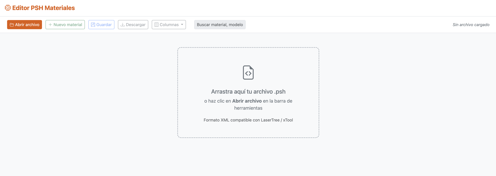
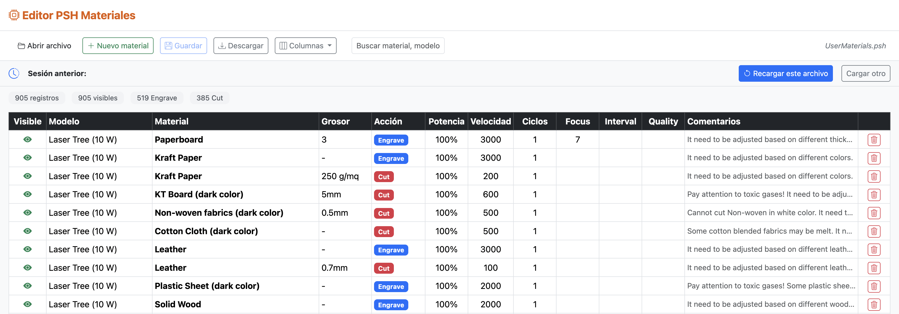
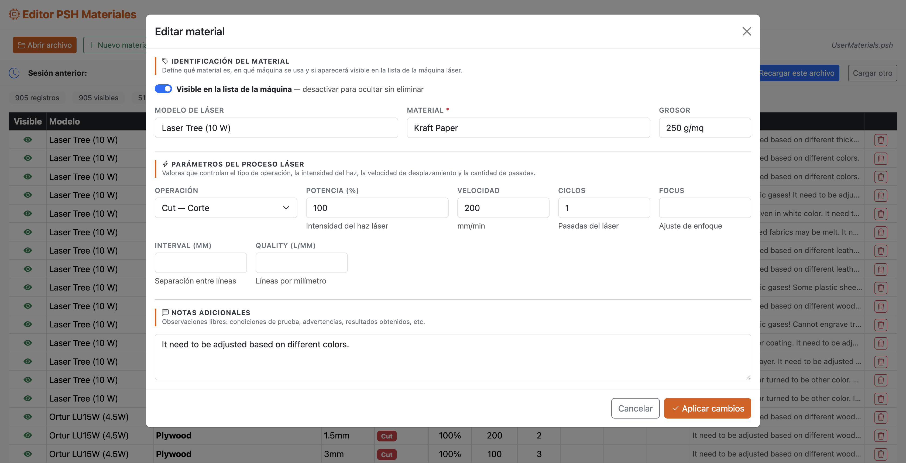

# Editor PSH Materiales

Herramienta web de código abierto para editar archivos `.psh` de materiales de máquinas láser compatibles con **LaserTree** y **xTool**. Funciona completamente en el navegador, sin instalación, sin servidor y sin dependencias externas.

---

## Capturas de pantalla

### Pantalla de inicio — carga de archivo



Abre o arrastra tu archivo `.psh` directamente sobre la zona central. Al cargar el archivo con el botón **Abrir archivo**, la aplicación solicita permiso de escritura para poder guardar los cambios directamente sobre el mismo archivo original.

---

### Vista de tabla — listado de materiales



Todos los materiales del archivo se muestran en una tabla paginada con búsqueda en tiempo real. La barra de estadísticas muestra el total de registros, cuántos están visibles, y el conteo por tipo de operación (Engrave / Cut).

---

### Modal de edición — formulario por secciones



El formulario agrupa los campos en tres secciones: identificación del material, parámetros del proceso láser y notas adicionales. Los cambios se guardan automáticamente en el archivo al hacer clic en **Aplicar cambios**.

---

## Características

- **Sin instalación** — archivo HTML único, ábrelo en cualquier navegador moderno
- **Lectura y escritura directa** del archivo `.psh` mediante la [File System Access API](https://developer.mozilla.org/en-US/docs/Web/API/File_System_Access_API)
- **Guardado automático** al confirmar cambios en el modal de edición o al eliminar un registro
- **Sesión persistente** — al reabrir la página, recuerda el último archivo y ofrece recargarlo
- **Paginación** configurable (25 / 50 / 100 / 200 registros por página)
- **Búsqueda** en tiempo real por material o modelo
- **Columnas configurables** — muestra u oculta columnas según lo que necesites ver; la preferencia se guarda en el navegador
- **Descarga** de copia del archivo para navegadores sin soporte de escritura directa
- **Campos completos** por registro:

| Campo | Descripción |
|---|---|
| Visible | Si el material aparece en la lista de la máquina |
| Modelo | Modelo de láser (ej. LaserTree 10W, xTool S1) |
| Material | Nombre del material (ej. MDF, Acrílico, Cuero) |
| Grosor | Grosor de la pieza (ej. 3mm) |
| Acción | Tipo de operación: Engrave, Cut o Fill |
| Potencia | Intensidad del haz láser (%) |
| Velocidad | Velocidad de desplazamiento (mm/min) |
| Ciclos | Número de pasadas |
| Focus | Ajuste de enfoque |
| Interval | Separación entre líneas (mm) |
| Quality | Líneas por milímetro (l/mm) |
| Comentarios | Notas libres sobre condiciones de uso |

---

## Uso

1. Descarga o clona el repositorio
2. Abre `editor_psh.html` en un navegador compatible (Chrome, Edge o cualquier navegador basado en Chromium)
3. Haz clic en **Abrir archivo** o arrastra tu archivo `.psh` a la zona de carga
4. Edita, añade o elimina materiales; los cambios se guardan automáticamente en el archivo original
5. Si usas Firefox o Safari (sin soporte de escritura directa), usa el botón **Descargar** para obtener el archivo modificado

> **Nota:** La escritura directa sobre el archivo original requiere que el navegador soporte la File System Access API. Chrome y Edge son totalmente compatibles.

---

## Formato del archivo `.psh`

Los archivos `.psh` son documentos XML con la siguiente estructura:

```xml
<?xml version="1.0" standalone="yes"?>
<MaterialDB xmlns="http://tempuri.org/MaterialDB.xsd">
  <Materials>
    <Visible>true</Visible>
    <Model>Laser Tree (10 W)</Model>
    <Material>Kraft Paper</Material>
    <Thickness>-</Thickness>
    <Action>Engrave</Action>
    <Power>100</Power>
    <Speed>3000</Speed>
    <Cycles>1</Cycles>
    <Focus>0</Focus>
    <Interval>0</Interval>
    <Quality>0</Quality>
    <Remarks>Adjust based on paper weight</Remarks>
  </Materials>
</MaterialDB>
```

---

## Compatibilidad de navegadores

| Navegador | Apertura | Escritura directa |
|---|---|---|
| Chrome 86+ | ✅ | ✅ |
| Edge 86+ | ✅ | ✅ |
| Firefox | ✅ | ❌ (usar Descargar) |
| Safari | ✅ | ❌ (usar Descargar) |

---

## Tecnologías utilizadas

- HTML5 / CSS3 / JavaScript (vanilla, sin frameworks)
- [Bootstrap 5.3](https://getbootstrap.com/)
- [Bootstrap Icons 1.11](https://icons.getbootstrap.com/)
- File System Access API
- IndexedDB (para persistencia del handle de archivo entre sesiones)

---

## Licencia

MIT — libre para usar, modificar y distribuir.
